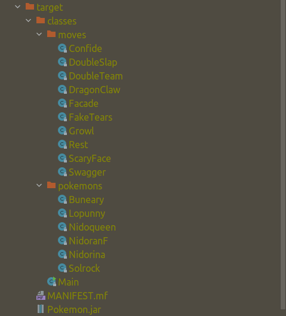

## Вторая лаба 😀
Чтобы добавить jar в локальный mvn репозиторий воспользуйтесь подобной командой:
```
mvn install:install-file -Dfile=Pokemon.jar -DgroupId=ru.ifmo.se -DartifactId=pokemon -Dversion=1.0 -Dpackaging=jar -DgeneratePom=true
```
### Человеческая сборка:
    mvn clean package
### Сборка ручками:
```
jar cmf MANIFEST.mf Test.jar Pokemon.jar -C classes/ .
```
